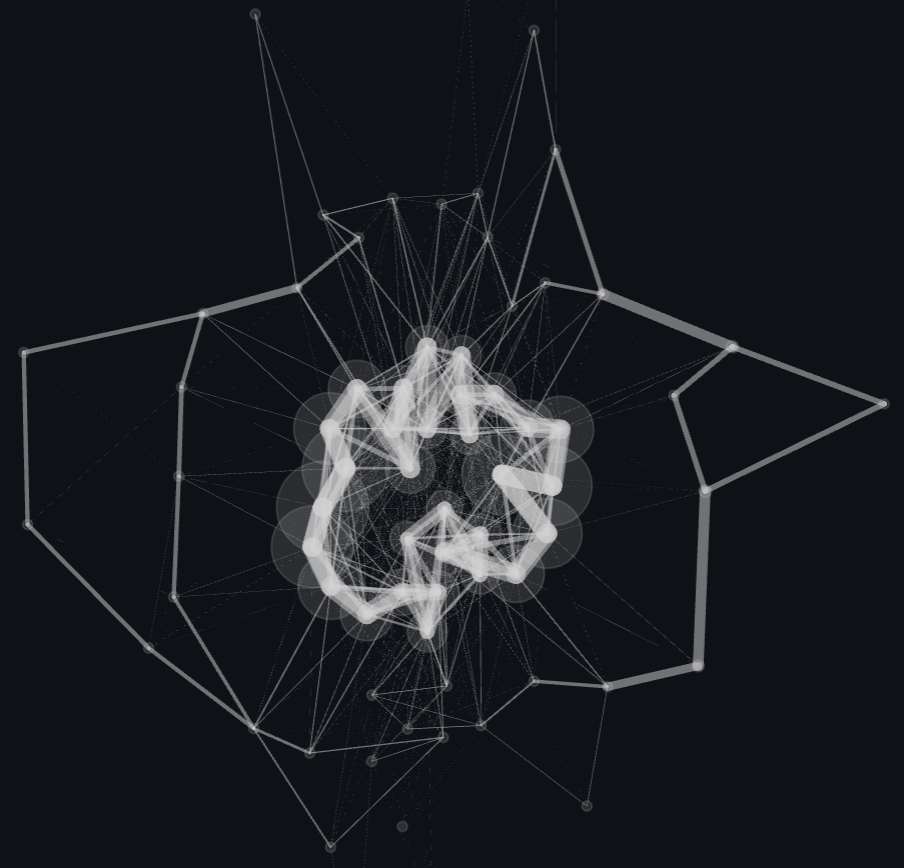

<p align="center">

</p>

<h1 align="center">Graphit</h1>
<h2 align="center">Graph-based Time Series Clustering Visualisation Tools</h2>

<div align="center">
<p>
 
</p>
</div>

<p align="center"><a href="https://graphit.streamlit.app/">Try our demo</a></p>
<p align="center">

</p>

Graphit is a Python-based web interactive tool to interpet and
compare time series clustering on several datasets of the [UCR-Archive](https://www.cs.ucr.edu/%7Eeamonn/time_series_data_2018/).
It is based on a novel graph-based time series clustering, called $k$-Graph.
$k$-Graph is divided into three steps: (i) Graph embedding, (ii) Graph clustering, 
and (iii) Consensus Clustering.  Moreover, we provide a way to select the most interpretable 
graph for the resulting clustering partition and allow the user to visualize the subsequences 
contained in the most representative and exclusive nodes. Graphit allows the user the interact with
the graphs and identifies the important subsequences that helps creating the clusters. You may find more information [here](https://github.com/boniolp/kGraph).


## Contributors

* [Paul Boniol](https://boniolp.github.io/), Inria, ENS, PSL University, CNRS
* [Donato Tiano](https://liris.cnrs.fr/en/member-page/donato-tiano), Università degli Studi di Modena e Reggio Emilia
* [Angela Bonifati](https://perso.liris.cnrs.fr/angela.bonifati/), Lyon 1 University, IUF, Liris CNRS
* [Themis Palpanas](https://helios2.mi.parisdescartes.fr/~themisp/), Université Paris Cité, IUF

## Usage

**Step 1:** Clone this repository using `git` and change into its root directory.

```(bash)
git clone https://github.com/boniolp/graphit.git
cd dsymb-playground/
```

**Step 2:** Create and activate a `conda` environment and install the dependencies.

```(bash)
conda create -n graphit python=3.9
conda activate graphit
pip install -r requirements.txt
```

**Step 3:** install Graphviz and pyGraphviz: 

* For Mac:

```(bash) 
brew install graphviz
```

* For Linux (Ubuntu):

```(bash) 
sudo apt install graphviz
```

* For Windows:

Stable Windows install packages are listed [here](https://graphviz.org/download/)

Once Graphviz is installed, you can install pygraphviz as follows:

```(bash) 
pip install pygraphviz
```

**Step 4:** You can use our tool in two different ways: 

- Access online: https://graphit.streamlit.app/
- Run locally (preferable for faster interaction). To do so, run the following command:

```(bash)
streamlit run Hello.py
```
